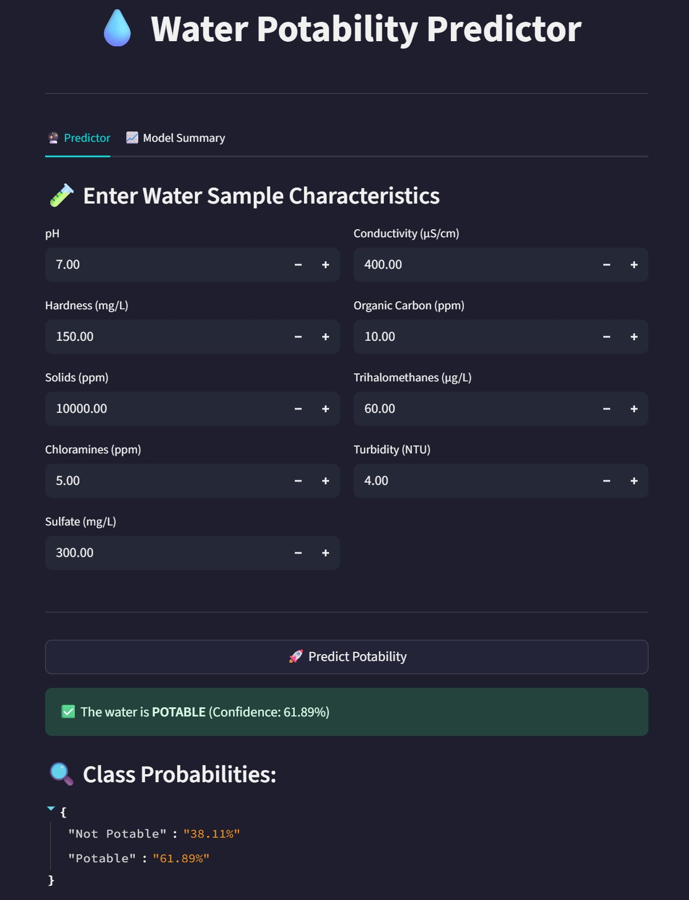

# 💧 Water Potability Prediction App

This project predicts whether water is potable (safe for drinking) based on various physicochemical properties. It includes a machine learning pipeline built using XGBoost, calibrated for better probability estimates, and a modern Streamlit web app for user interaction.

---

## 📂 Project Structure

```
WaterQuality-Predictor/
│
├── app/
│   └── streamlit_appV2.py          # Streamlit UI for model predictions
│
├── data/
│   └── water_potability_cleaned.csv   # Cleaned dataset
│
├── models/
│   ├── water_potability_model.pkl     # Trained calibrated model
│   └── scaler.pkl                     # Fitted StandardScaler
│
├── notebooks/
│   └── model_training_notebook.ipynb     # End-to-end training pipeline
│
├── docs/
│   ├── architecture_diagram.png     # Visual pipeline diagram
│   ├── streamlit_ui.png             # UI screenshot
│   └── feature_importance.png       # Barplot of feature importances
│
├── test_cases.md                # Sample test inputs/outputs
├── how_to_run.md               # Local setup & usage instructions
└── README.md                   # Project overview
```

---

## ⚙️ ML Workflow

1. Data is loaded from `water_potability_cleaned.csv`
2. SMOTE is applied to balance the classes
3. Features are standardized with `StandardScaler`
4. A calibrated `XGBClassifier` is trained
5. Model & scaler are saved to disk

---

## 🌐 Streamlit App

- Accepts 9 water quality features as user input
- Predicts **Potable / Not Potable**
- Displays confidence percentage & class probabilities
- Clean UI with tabs, emoji feedback & dark mode

---

## 🧪 Sample Output



---

## 🔍 Feature Importance


---

## 📊 Confusion Matrix (Test Set)

| Actual \ Predicted | Not Potable | Potable |
|---------------------|-------------|---------|
| **Not Potable**     |     260     |   134   |
| **Potable**         |     147     |   259   |

---

## ✅ Accuracy

**65% balanced accuracy** using SMOTE + XGBoost + Calibration

---

## 🙌 Author

- **Pramath Parashar** (Independent Researcher, Formerly at Kent State University)
