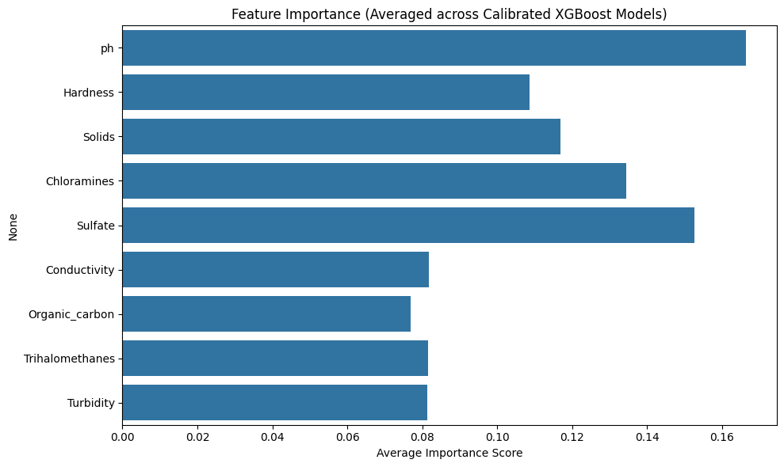

# 🧠 Model Summary — Water Potability Predictor

This document outlines the machine learning pipeline, model configuration, performance evaluation, and final output setup for the Water Potability Prediction project.

---

## 1. 📂 Dataset

- **Source**: Public dataset with water quality measurements
- **Initial Size**: ~3,200 rows
- **Features (9 total)**:
  - `ph`
  - `Hardness`
  - `Solids`
  - `Chloramines`
  - `Sulfate`
  - `Conductivity`
  - `Organic_carbon`
  - `Trihalomethanes`
  - `Turbidity`
- **Target**: `Potability` (0 = Not Potable, 1 = Potable)

---

## 2. 🧼 Preprocessing Steps

| Step                 | Description                                 |
|----------------------|---------------------------------------------|
| Missing Value Removal | Rows with any nulls dropped                |
| SMOTE (Oversampling) | Balanced the imbalanced target classes      |
| StandardScaler       | Standardized all numerical features         |
| Train/Test Split     | 80% training / 20% testing (after SMOTE)    |

---

## 3. ⚙️ Model Architecture

**Base Estimator**: `XGBClassifier` from `xgboost`

| Parameter        | Value      |
|------------------|------------|
| n_estimators     | 100        |
| max_depth        | 4          |
| learning_rate    | 0.1        |
| eval_metric      | logloss    |
| random_state     | 42         |

Wrapped with **`CalibratedClassifierCV(cv=5)`** for better probability estimates.

---

## 4. 🧪 Evaluation Metrics

| Metric         | Value (Test Set) |
|----------------|------------------|
| Accuracy       | ~65%             |
| Precision      | ~64–66%          |
| Recall         | ~64–66%          |
| F1-Score       | ~65%             |

Confusion Matrix (approx):

```
[[260 134]
 [147 259]]
```

---

## 5. ✅ Saved Artifacts

| File                                | Purpose                     |
|-------------------------------------|-----------------------------|
| `models/water_potability_model.pkl` | Calibrated XGBoost model    |
| `models/scaler.pkl`                 | StandardScaler instance     |

These are loaded in the Streamlit app for real-time prediction.

---

## 6. 📊 Feature Importance (XGBoost)



The most influential features:
- `Sulfate`
- `Trihalomethanes`
- `Conductivity`
- `Chloramines`

---

## 7. 🔮 Prediction Format (App Output)

- Binary output: **Potable** or **Not Potable**
- Confidence score (%)
- Display of class probabilities

Example:
```json
{
  "Not Potable": "28.27%",
  "Potable": "71.73%"
}
```
